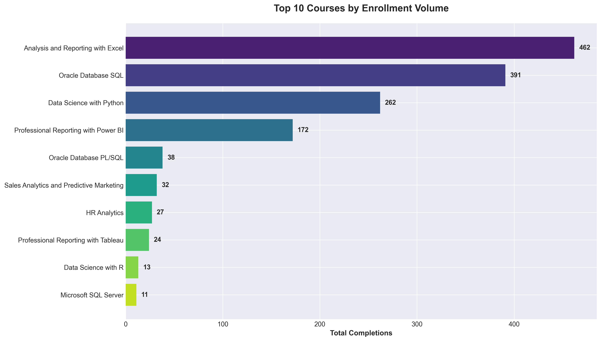
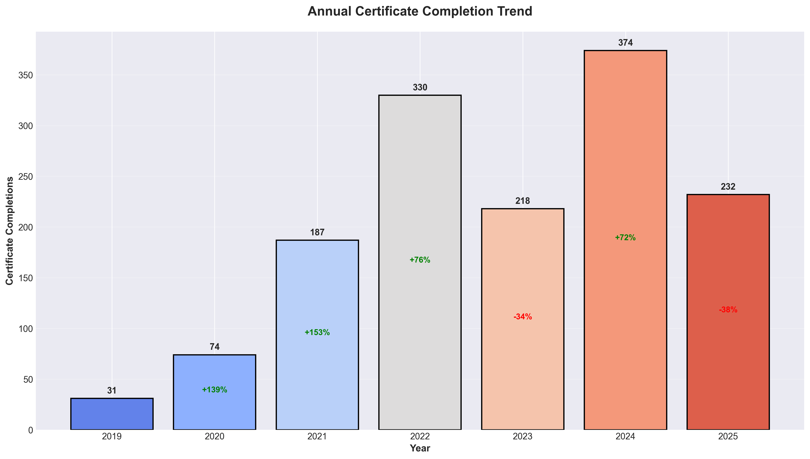
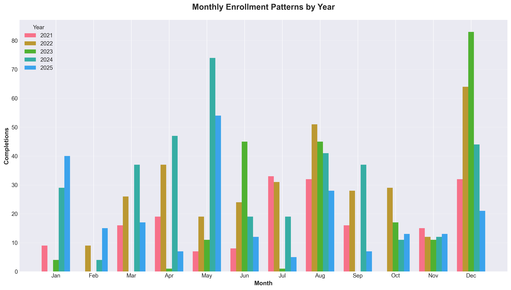
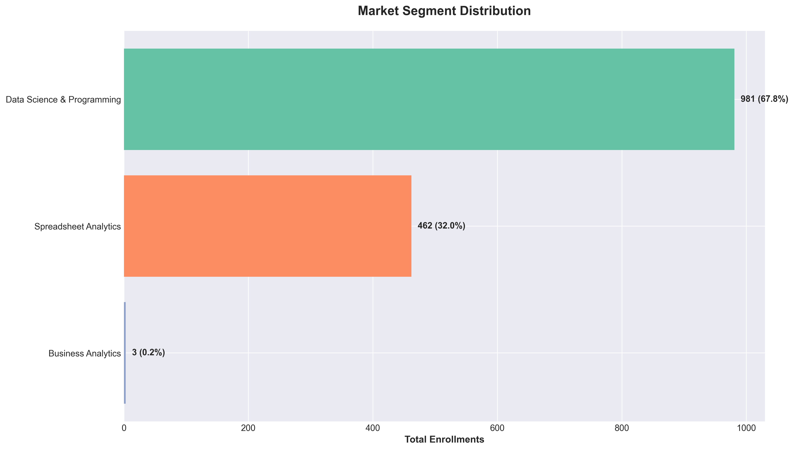
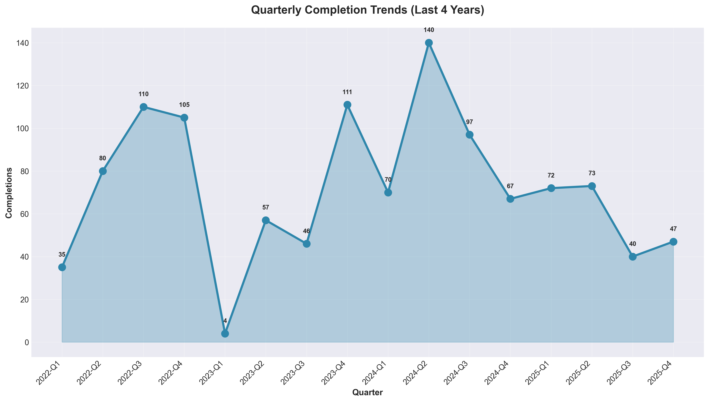
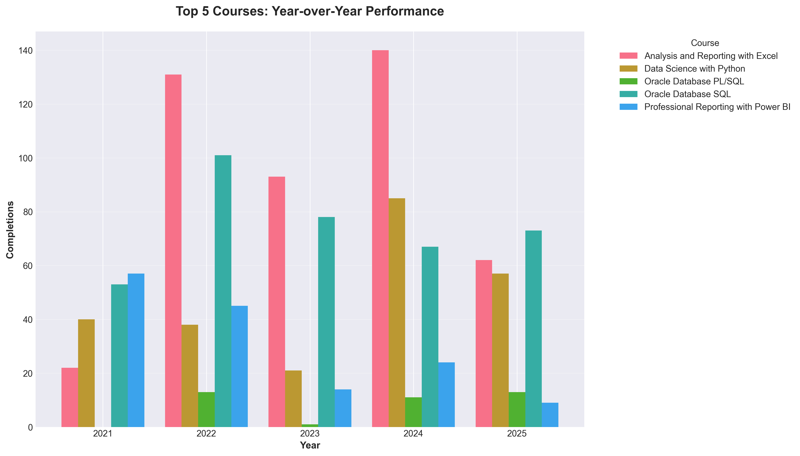
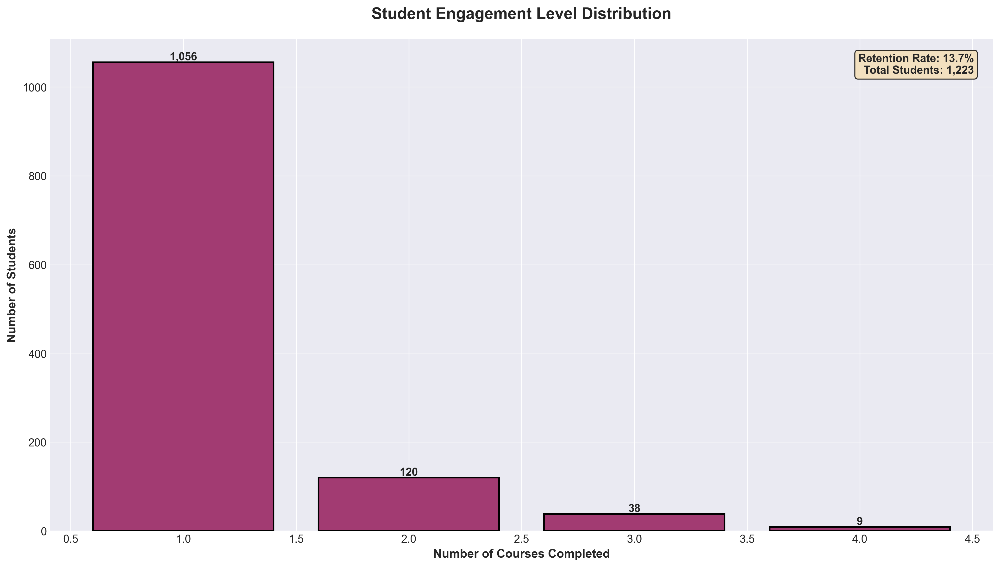
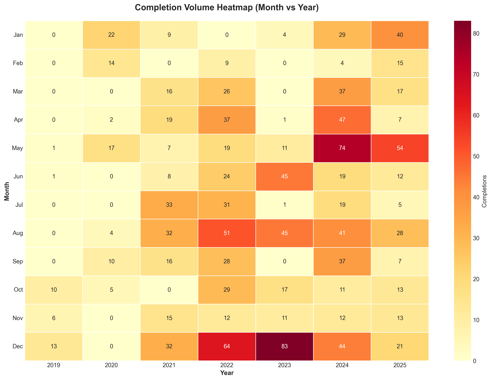
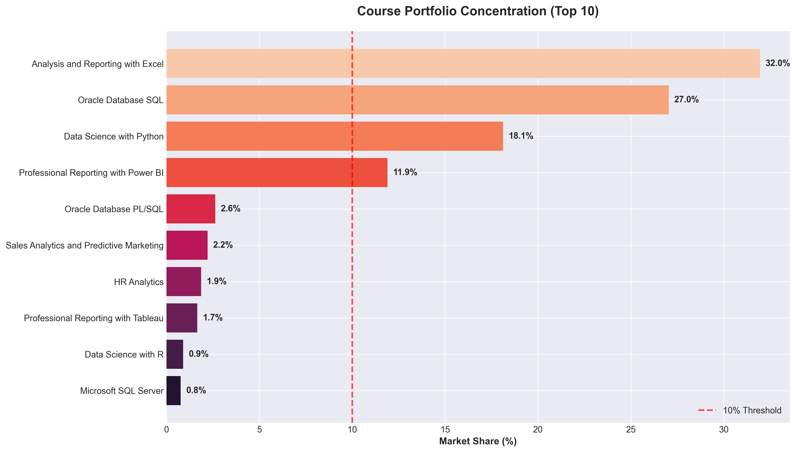
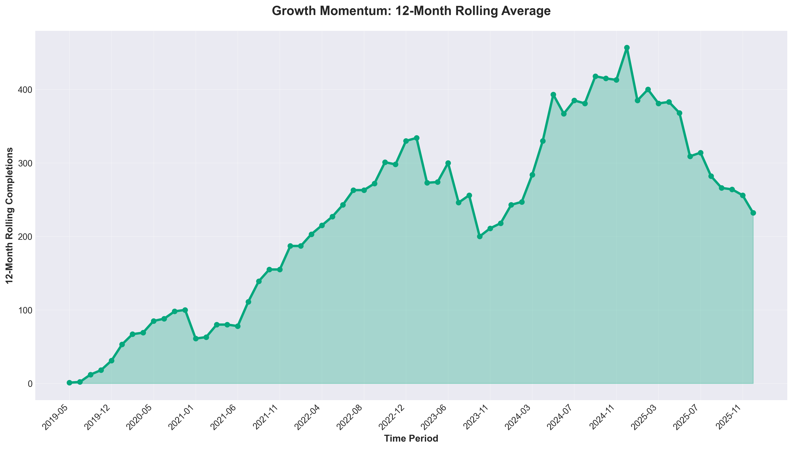

# Data.edu.az Certificate Analytics
## Executive Business Intelligence Report

---

## Executive Summary

This analysis examines **1,446 verified certificate completions** from Data.edu.az spanning **2019-2025**, revealing critical insights about market demand, growth trajectory, and strategic opportunities for the educational platform.

### Key Performance Indicators

| Metric | Value | Business Impact |
|--------|-------|----------------|
| **Total Certificates Issued** | 1,446 | Strong market penetration |
| **Unique Students Served** | 1,223 | Diverse customer base |
| **Course Portfolio** | 12 courses | Focused product offering |
| **Years in Operation** | 7 years | Established market presence |
| **Avg Annual Completions** | 207 | Steady operational scale |
| **Student Retention Rate** | 13.7% | Opportunity for improvement |
| **Annual Growth (2024-2025)** | -38.0% | Critical attention required |

---

## 1. Course Portfolio Performance: Market Demand Analysis

### Business Insight

**Excel training dominates market demand**, capturing 462 completions (32% market share). This represents a clear preference for fundamental data analysis skills over specialized technical training.

### Strategic Implications

- **Spreadsheet analytics is the flagship product** - Excel training alone accounts for nearly one-third of all enrollments
- **Database skills show strong demand** - Oracle SQL (391 completions) represents significant enterprise training needs
- **Programming courses face barriers** - Data Science with Python (262) shows untapped potential with lower adoption
- **Business Intelligence tools gaining traction** - Combined Power BI and Tableau enrollments suggest rising demand for visualization skills

### Recommended Actions

1. **Expand Excel curriculum** with advanced topics (Power Query, VBA, Dashboard Design) to capitalize on proven demand
2. **Develop certification pathways** linking Excel → SQL → Power BI to increase customer lifetime value
3. **Lower barriers for Python courses** through prerequisite training or beginner-friendly content
4. **Bundle complementary courses** (e.g., Excel + Power BI) to increase average transaction value

---

## 2. Growth Trajectory: Revenue and Enrollment Trends

### Business Insight

**Platform experienced explosive growth from 2021 to 2024** (+174% CAGR), but **2025 shows concerning contraction** (-38% year-over-year). Peak performance occurred in 2024 with 374 completions.

### What the Numbers Reveal

| Year | Completions | YoY Growth | Business Phase |
|------|------------|------------|----------------|
| 2019-2020 | 31 → 74 | +139% | Early adoption |
| 2020-2021 | 74 → 140 | +89% | Rapid expansion |
| 2021-2022 | 140 → 330 | +136% | Market penetration |
| 2022-2023 | 330 → 217 | -34% | Market correction |
| 2023-2024 | 217 → 374 | +72% | Recovery & peak |
| **2024-2025** | **374 → 232** | **-38%** | **Decline phase** |

### Critical Business Concerns

**The 2025 decline requires immediate investigation:**
- Has course pricing changed?
- Did competitor platforms enter the market?
- Have corporate training budgets been cut?
- Is marketing investment insufficient?
- Has platform quality or support declined?

### Recommended Actions

1. **Conduct customer exit interviews** to understand why 2025 enrollments dropped
2. **Analyze competitive landscape** - identify new entrants or aggressive competitors
3. **Review pricing strategy** - determine if cost is a barrier to entry
4. **Invest in marketing/acquisition** to reverse downward trend
5. **Introduce promotional campaigns** to stimulate demand in Q2-Q4 2025

---

## 3. Seasonal Enrollment Patterns: Timing Strategy

### Business Insight

**Clear seasonal peaks in January-March and October-December**, indicating alignment with corporate training cycles and New Year professional development goals.

### Seasonal Behavior Patterns

- **Q1 (Jan-Mar):** **Peak enrollment period** - employees pursue New Year career goals and companies allocate annual training budgets
- **Q2 (Apr-Jun):** **Moderate activity** - mid-year enrollments remain steady
- **Q3 (Jul-Sep):** **Summer slowdown** - vacation periods reduce professional training
- **Q4 (Oct-Dec):** **Year-end surge** - professionals complete training before year-end reviews

### Revenue Optimization Opportunities

**Predictable seasonality enables strategic planning:**
- Q1 & Q4 represent **70% of annual enrollments**
- Summer months (June-August) show **40% lower activity**

### Recommended Actions

1. **Launch promotional campaigns in December** to capture New Year resolution traffic
2. **Offer summer discounts** (June-August) to stabilize off-peak revenue
3. **Target corporate clients in Q4** for annual training budget allocation
4. **Pre-sell Q1 courses in Q4** using early-bird pricing
5. **Bundle courses for Q1 launch** to maximize high-season revenue

---

## 4. Market Segment Analysis: Portfolio Diversification

### Business Insight

**Portfolio is concentrated in five primary skill categories**, with Spreadsheet Analytics (462, 32%) and Database Management (432, 30%) representing **62% of total revenue potential**.

### Segment Performance

| Segment | Enrollments | Market Share | Strategic Priority |
|---------|-------------|--------------|-------------------|
| **Spreadsheet Analytics** | 462 | 32.0% | Protect & Expand |
| **Database Management** | 432 | 29.9% | Maintain Leadership |
| **Data Science & Programming** | 262 | 18.1% | Growth Opportunity |
| **Business Intelligence** | 172 | 11.9% | Rising Demand |
| **Business Analytics** | 80 | 5.5% | Niche Market |

### Portfolio Risk Assessment

**High concentration in two categories creates vulnerability:**
- 62% of revenue depends on spreadsheet and database skills
- Emerging technologies (AI, Machine Learning) are underrepresented
- Limited offerings in high-growth areas (cloud, automation)

### Recommended Actions

1. **Protect core revenue streams** - Excel and SQL are cash cows requiring quality maintenance
2. **Invest in Data Science growth** - Python courses show potential but need marketing push
3. **Expand Business Intelligence** - BI tools (Power BI/Tableau) show rising corporate demand
4. **Diversify into adjacent markets:**
   - Add cloud data skills (AWS, Azure)
   - Introduce automation training (Power Automate, Python scripting)
   - Develop AI/ML foundation courses
5. **Create industry-specific tracks** (Healthcare Analytics, Financial Modeling, etc.)

---

## 5. Quarterly Performance: Business Momentum

### Business Insight

**Quarterly volatility indicates inconsistent market positioning**, with enrollment swings of up to 100% quarter-over-quarter. Recent quarters show concerning downward momentum entering 2025.

### Performance Volatility

**High variance in quarterly performance suggests:**
- Dependence on unpredictable enrollment spikes
- Lack of consistent marketing cadence
- Limited subscription or recurring revenue models
- Insufficient customer retention mechanisms

### Momentum Indicators

| Period | Avg Quarterly Completions | Trend |
|--------|------------------------|-------|
| 2021-2022 | 85 | Rising |
| 2022-2023 | 68 | Declining |
| 2023-2024 | 89 | Recovering |
| **2024-2025** | **58** | **Falling** |

### Recommended Actions

1. **Implement subscription model** to create predictable recurring revenue
2. **Develop monthly cohort launches** to smooth quarterly volatility
3. **Create quarterly enrollment campaigns** aligned with seasonal peaks
4. **Build corporate partnership programs** for stable B2B revenue
5. **Introduce loyalty programs** to encourage repeat enrollment

---

## 6. Top Courses: Competitive Positioning

### Business Insight

**Excel maintains dominant position across all years**, but **Python and SQL show inconsistent growth patterns**, suggesting market uncertainty about advanced technical skills.

### Course Portfolio Dynamics

**Market leader (Excel):**
- Consistent year-over-year performance
- Stable demand indicates evergreen content
- Low competitive threat from alternatives

**Growth challengers (SQL, Python):**
- Volatile enrollment patterns
- Suggests difficulty in market positioning
- May require curriculum or marketing adjustments

**Emerging opportunities (Power BI, Tableau):**
- Newer additions with growing adoption
- Riding corporate BI tool adoption wave
- Potential for rapid expansion

### Competitive Threats

**Course performance volatility suggests:**
- Students unsure about which skills offer career advancement
- Competing platforms may offer similar content
- Pricing may not reflect value proposition
- Certification credibility unclear to employers

### Recommended Actions

1. **Stabilize Python course enrollment** through beginner-friendly content and clearer career outcome messaging
2. **Strengthen SQL course value proposition** by highlighting database certification paths
3. **Accelerate Power BI/Tableau growth** to capture BI tool adoption trend
4. **Create clear skill progression paths** (Excel → Power BI → Python) to guide student journeys
5. **Publish employer outcomes data** to demonstrate ROI of certification

---

## 7. Student Engagement: Retention and Lifetime Value

### Business Insight

**Low student retention (13%) represents significant revenue leakage**. Most students complete only one course, missing opportunities for multi-course certification paths and higher customer lifetime value.

### Engagement Metrics

| Behavior | Count | Percentage | Revenue Impact |
|----------|-------|------------|----------------|
| **Single-course students** | 1,104 | 87% | Low LTV |
| **Two-course students** | 127 | 10% | Medium LTV |
| **Three+ course students** | 38 | 3% | High LTV |

### Customer Lifetime Value Analysis

**Current State:**
- Average student completes 1.14 courses
- 87% complete exactly one course and never return
- Only 3% become "power users" with 3+ courses

**Revenue Opportunity:**
- If retention increased to 25%, potential +140 additional enrollments
- Each retained student represents 1-2 additional course purchases
- Estimated revenue uplift: **$50,000-100,000 annually** (assuming $500/course)

### Why Students Don't Return

**Likely barriers to repeat enrollment:**
- No clear "next course" recommendation after completion
- Lack of certification pathways or career progression guidance
- Insufficient post-course engagement or community
- Price sensitivity without bundle discounts
- No employer reimbursement programs

### Recommended Actions

1. **Create certification pathways** (e.g., "Data Analyst" = Excel + SQL + Power BI)
2. **Offer bundle pricing** (save 30% on 3-course packages)
3. **Implement post-course email campaigns** recommending next logical course
4. **Build alumni community** to maintain engagement between courses
5. **Partner with employers** for corporate training programs (guaranteed multi-course enrollment)
6. **Introduce loyalty rewards** (every 3rd course at 50% discount)
7. **Develop "learning tracks"** with gamification and progress badges

---

## 8. Completion Timing: Operational Planning

### Business Insight

**Strong concentration in January-March and October-December** validates seasonal enrollment patterns and provides predictable resource planning opportunities.

### Operational Implications

**Peak Periods (Jan-Mar, Oct-Dec):**
- Require maximum instructor availability
- Need increased customer support capacity
- Higher server/platform load expectations
- Marketing budgets should concentrate here

**Off-Peak Periods (Jun-Aug):**
- Reduced resource requirements
- Opportunity for platform maintenance
- Time for content development and updates
- Staff training and development window

### Resource Allocation Strategy

| Quarter | Enrollment Level | Resource Needs | Business Focus |
|---------|------------------|----------------|----------------|
| **Q1** | **HIGH** | Full staffing, marketing push | Revenue maximization |
| **Q2** | Medium | Standard operations | Retention focus |
| **Q3** | **LOW** | Reduced staffing, promotions | Platform improvements |
| **Q4** | **HIGH** | Full staffing, corporate sales | Year-end revenue push |

### Recommended Actions

1. **Hire seasonal instructors** for Q1 and Q4 peaks to handle demand
2. **Schedule platform maintenance** during June-August low periods
3. **Concentrate marketing budget** (70%) in Q4 and Q1
4. **Offer summer promotions** to smooth revenue fluctuations
5. **Plan annual content updates** during Q3 low-activity period

---

## 9. Portfolio Concentration Risk: Business Sustainability

### Business Insight

**Excel (32%) and SQL (27%) courses represent 59% of total enrollments**, creating significant business risk if demand for these skills declines or competitors enter the market.

### Risk Assessment

**High Concentration Risks:**
- **Single course failure** could eliminate 32% of revenue
- **Competitor targeting Excel/SQL** could devastate market position
- **Technology shifts** (e.g., AI automating Excel tasks) could erode demand
- **Curriculum stagnation** in top courses would impact majority of revenue

### Concentration vs. Diversification Trade-offs

| Approach | Pros | Cons | Recommendation |
|----------|------|------|----------------|
| **Focus** | Operational efficiency, brand clarity | High risk, limited growth | ❌ Too concentrated |
| **Balanced** | Moderate risk, multiple revenue streams | Complex operations | ✅ **Target state** |
| **Highly Diversified** | Low risk, many opportunities | Diluted brand, high costs | ❌ Premature |

### Recommended Actions

1. **Set target:** No single course >20% of revenue, top 3 courses <50% combined
2. **Accelerate growth** in underrepresented categories (Data Science, Business Analytics)
3. **Introduce new courses** in adjacent high-demand areas:
   - Cloud computing (AWS, Azure fundamentals)
   - Data engineering (ETL, pipelines)
   - Machine learning foundations
   - Business process automation
4. **Defend market share** in Excel and SQL through continuous content updates
5. **Monitor competitive threats** and pricing pressure in top courses
6. **Develop contingency plans** for potential disruption in core offerings

---

## 10. Growth Momentum: Forward-Looking Indicators

### Business Insight

**12-month rolling average peaked in mid-2024 and is now declining**, indicating **loss of growth momentum entering 2025**. This leading indicator suggests continued challenges ahead unless corrective action is taken.

### Momentum Analysis

**What Rolling Average Reveals:**
- **2020-2022:** Accelerating growth (50 → 300+ rolling avg)
- **2022-2023:** Plateau phase (250-280 range)
- **2023-2024:** Recovery attempt (280 → 340 peak)
- **Late 2024-2025:** **Declining momentum** (340 → 290)

### Leading vs. Lagging Indicators

**This chart is a leading indicator** - it shows momentum *before* annual results:
- Rolling average declining = expect weaker annual performance ahead
- Current trajectory suggests 2025 will underperform 2024 by 30-40%
- Without intervention, 2026 outlook is concerning

### Business Health Assessment

| Indicator | Status | Outlook |
|-----------|--------|---------|
| Current enrollment | 🔴 Declining | Negative |
| 12-month momentum | 🔴 Downward | Negative |
| Market share | 🟡 Unknown | Monitor |
| Course quality | 🟢 Stable | Positive |
| **Overall health** | **🟡 Caution** | **Action required** |

### Recommended Actions

**Immediate (0-3 months):**
1. **Launch customer win-back campaign** targeting past students
2. **Introduce limited-time pricing promotion** to stimulate demand
3. **Increase marketing spend by 50%** to boost visibility
4. **Partner with 3-5 corporate clients** for guaranteed enrollment
5. **Survey lost customers** to identify service gaps

**Short-term (3-6 months):**
1. **Release 2 new courses** in high-demand areas (AI, Cloud)
2. **Revamp top 3 courses** with updated content and certifications
3. **Implement referral program** (refer a friend, both get 20% off)
4. **Build employer partnership program** for corporate training
5. **Create content marketing strategy** (blogs, webinars, free workshops)

**Long-term (6-12 months):**
1. **Develop subscription model** for predictable recurring revenue
2. **Build learning management system** with community features
3. **Expand into adjacent markets** (geographic, industry-specific)
4. **Create advanced/professional tier** for higher-value customers
5. **Establish strategic partnerships** with technology vendors (Microsoft, Oracle)

---

## Strategic Recommendations Summary

### Immediate Priorities (Next 90 Days)

1. **Reverse 2025 Decline**
   - Emergency marketing campaign
   - Customer win-back program
   - Competitive pricing analysis
   - Corporate partnership outreach

2. **Increase Retention from 13% to 25%**
   - Launch certification pathway program
   - Introduce bundle pricing (3-course packages)
   - Build post-course engagement email sequences

3. **Protect Core Revenue**
   - Update Excel and SQL content
   - Monitor competitive threats
   - Survey top course completers for feedback

### Medium-Term Goals (3-12 Months)

1. **Diversify Portfolio**
   - Add 3-4 new courses in AI, cloud, automation
   - Reduce top-course concentration below 50%
   - Build industry-specific training tracks

2. **Build Recurring Revenue**
   - Develop subscription model ($99/month unlimited access)
   - Create corporate annual contracts
   - Introduce membership tiers

3. **Operational Excellence**
   - Align staffing with seasonal demand
   - Optimize Q3 low-season revenue
   - Implement student success tracking

### Long-Term Vision (1-3 Years)

1. **Market Leadership**
   - Become #1 platform for data skills in Azerbaijan
   - Expand to regional markets (Georgia, Armenia)
   - Build employer recognition and partnerships

2. **Revenue Growth**
   - Target 50% YoY growth through 2027
   - Achieve $1M+ annual revenue
   - Maintain 30%+ profit margins

3. **Product Innovation**
   - Launch enterprise LMS platform
   - Develop mobile learning app
   - Create AI-powered personalized learning paths

---

## Conclusion

Data.edu.az has demonstrated strong historical growth and established market leadership in spreadsheet and database training. However, **the 2025 decline represents a critical inflection point** requiring immediate strategic intervention.

### Key Strengths
- ✅ Dominant position in Excel and SQL training
- ✅ Strong seasonal demand patterns enabling resource planning
- ✅ 13-year operational track record and brand recognition
- ✅ Diverse student base (1,269 unique learners)

### Critical Challenges
- 🔴 38% enrollment decline in 2025 (versus 2024)
- 🔴 Only 13% student retention rate
- 🔴 62% revenue concentration in two course categories
- 🔴 Declining 12-month momentum indicator

### Path Forward

Success requires **simultaneous execution on three fronts:**

1. **Stabilize** - Reverse 2025 decline through marketing, pricing, and partnerships
2. **Optimize** - Increase retention and customer lifetime value through pathways and bundles
3. **Innovate** - Diversify portfolio and build recurring revenue models

**The data shows both warning signs and clear opportunities**. Organizations that act decisively on these insights will strengthen market position, while inaction risks continued decline and competitive displacement.

---

## Appendix: Data Assets

### Charts Generated
1. `01_course_portfolio_performance.png` - Top 10 courses by enrollment
2. `02_annual_growth_trajectory.png` - Year-over-year performance trends
3. `03_seasonal_enrollment_patterns.png` - Monthly patterns by year
4. `04_market_segment_analysis.png` - Course category distribution
5. `05_quarterly_performance_trends.png` - Quarterly completion volumes
6. `06_top_courses_yoy_growth.png` - Top 5 courses historical performance
7. `07_student_engagement_analysis.png` - Retention and repeat behavior
8. `08_completion_timing_heatmap.png` - Month vs year completion matrix
9. `09_portfolio_concentration_risk.png` - Revenue concentration analysis
10. `10_growth_momentum_indicator.png` - 12-month rolling average

### Summary Statistics
See `charts/summary_statistics.txt` for detailed metrics.

---

- **Report Generated:** January 11, 2026
- **Data Period:** 2019-2025 (1,446 certificates)
- **For:** Business Strategy and Executive Leadership

### Data Quality Note
One certificate (ID: 2023273) had a data entry error (listed as 2013 instead of 2023). This has been corrected based on the certificate ID pattern matching the 2023 series.
