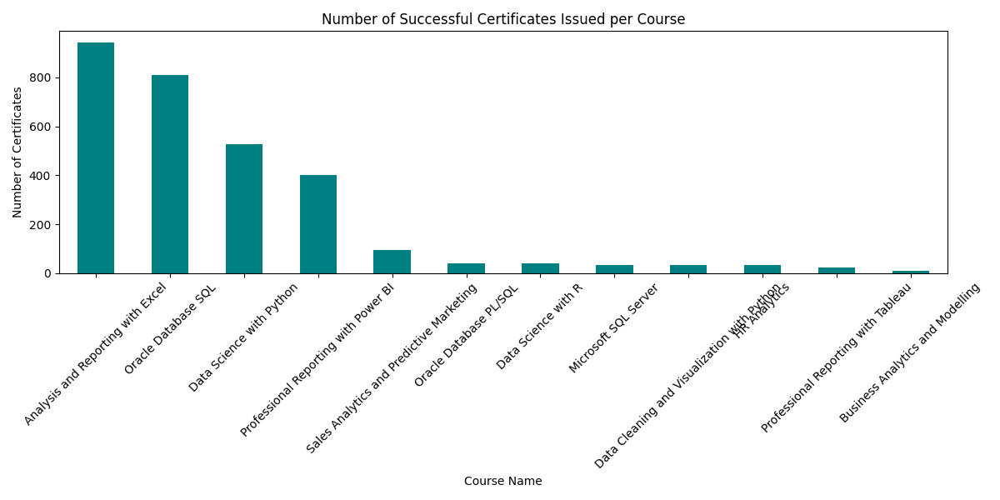
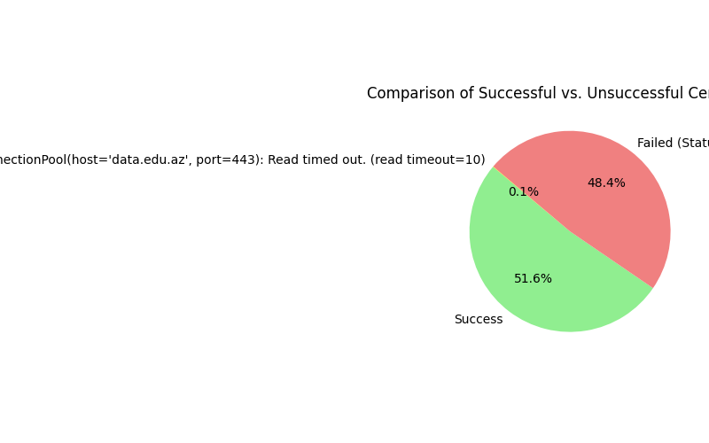

## Data Edu Az Analysis Project

### Project Overview

This project analyzes data from certificate completions for various courses between the years 2020 to 2024. The primary goal is to derive insights into course performance, student engagement trends, and other key aspects that can inform strategic improvements and revenue opportunities.

### Analysis Conducted

1. **Successful Certificates per Course**  
     
   This chart shows the distribution of successful certificates across different courses. Certain courses exhibit significantly higher completion rates.

2. **Monthly Trends of Successful Completions**  
     
   This chart displays monthly trends in successful completions, highlighting engagement spikes and troughs.

3. **Comparison of Successful vs. Unsuccessful Certificates**  
     
   This pie chart compares the proportion of successful versus failed certificate completions.

4. **Course Duration Distribution**  
     
   This histogram shows the distribution of durations for successful completions.

5. **Top Courses by Year**  
     
   Displays the top-performing course for each year with the number of completions.

6. **Short Courses Analysis**  
     
   Highlights successful completions for courses shorter than 3 months.

7. **Specific Course Analysis**  
     
   Analyzes the distribution of successful completions for a specific course.

8. **Heatmap of Course Completion Trends by Year and Month**  
     
   Visualizes trends in course completions over the years and months using a heatmap.

9. **Top Students with Multiple Successful Certificates**  
     
   Shows students with multiple successful completions.

---

### Summary and Recommendations

1. **Expand High-Demand Courses**: Focus on courses with consistently high completions, potentially introducing advanced or specialized variations.
2. **Short Course Offerings**: Capitalize on the popularity of shorter courses by offering more micro-learning options.
3. **Address Course Dropouts**: Analyze and reduce barriers to successful completion, providing more support to struggling learners.
4. **Engage with Data**: Use trends from the heatmap and annual data to inform course scheduling, promotional activities, and content updates.
5. **Personalization and Loyalty Programs**: Consider offering incentives to repeat learners or those with multiple successful completions.

### How to Run

1. Ensure your data files are present in the `certificate_data` directory.
2. Run the main script (`scraper.py`) to process the data and generate the visualizations:
   ```
   python scraper.py
   ```
3. Output images are saved in the `certificate_data` directory for easy access and review.

### Prerequisites

Ensure you have the following installed in your Python environment:
- `pandas`
- `matplotlib`
- `seaborn` (for heatmap visualization)

You can install the required packages using:
```
pip install -r requirements.txt
```